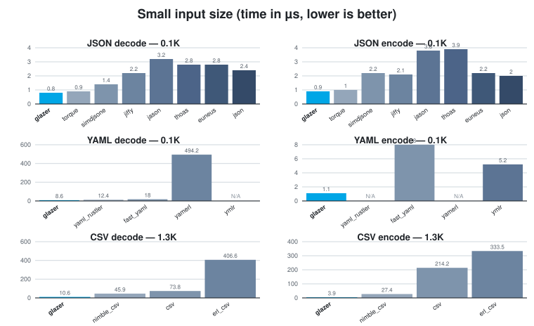
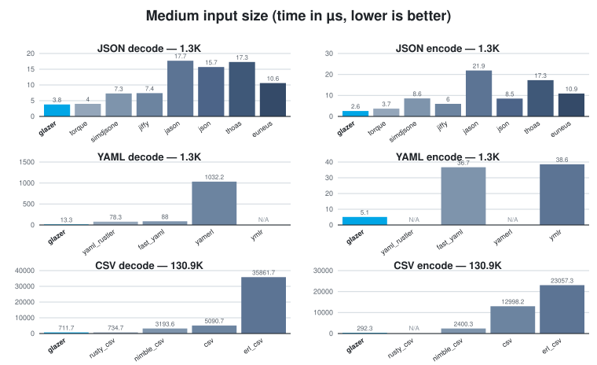
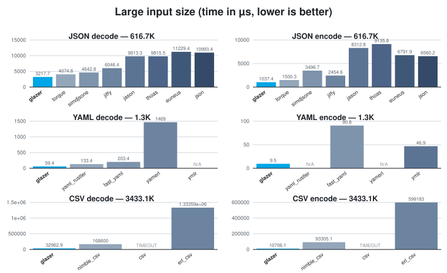

# Glazer

[](https://github.com/saleyn/glazer/actions/workflows/erlang.yaml)
[](https://hex.pm/packages/glazer)
[](https://hex.pm/packages/glazer)

Very fast Erlang NIF encoder/decoder for **JSON**, **YAML**, and **CSV**,
built around hand-rolled recursive-descent decoders and direct
term-to-text encoders that produce/consume native Erlang terms in a
single pass. The JSON implementation was inspired by the
[glaze](https://github.com/stephenberry/glaze) C++ library; `glazer` has
since matured into a standalone implementation with no external C++
dependencies, and extended the same approach to YAML and CSV, with
performance and features unmatched by other existing libraries for these
formats.

## Performance

- **[JSON](#performance-1)**: faster encoding than every other library
  benchmarked, and roughly on par with `torque` (Rust `sonic-rs` NIF) on
  decoding — both well ahead of `simdjsone`, `jiffy`, and the pure-Elixir
  libraries `jason`, `thoas`, `euneus`, and OTP's built-in `json`.
- **[YAML](#benchmarking-yaml)**: an order of magnitude faster than
  `yaml_rustler` and `fast_yaml`, and ~10-100x faster than the pure-Erlang
  `yamerl`/`ymlr`.
- **[CSV](#benchmarking-csv)**: 2-20x faster than `nimble_csv`, and tens to
  hundreds of times faster than `csv` and `erl_csv` (which times out on
  large inputs).





Each chart compares glazer against other libraries for JSON/YAML/CSV
decode and encode on a representative small/medium/large file. Charts are
generated from the tables below via `scripts/gen_bench_charts.py`.
Benchmark tables:
- [Benchmarking JSON](#benchmarking-json)
- [Benchmarking YAML](#benchmarking-yaml)
- [Benchmarking CSV](#benchmarking-csv)

## Features

### JSON

- Decoding straight to Erlang terms: maps, lists, binaries, integers
  (including bignums), floats, booleans, and `null`
- Encoding Erlang terms straight to JSON, including big integers
- Incremental/streaming decoding of partial input (e.g. NDJSON over a
  socket) via `json_stream_decoder/0,1`, `json_stream_feed/2`, `json_stream_eof/1`
- Configurable representation of JSON `null` and JSON object keys
- `json_minify/1` and `json_prettify/1` helpers
- Standalone big-integer encode/decode helpers
  (`encode_integer/1`, `decode_integer/1`, `try_decode_integer/1`)

### YAML

- Decoding YAML mappings/sequences/scalars to Erlang maps/lists/scalars,
  including big integers
- Encoding Erlang terms to YAML in block style
- Configurable representation of YAML `null` and mapping keys, with
  optional YAML 1.1 boolean compatibility (`yes`/`no`/`on`/`off`)

### CSV

- RFC 4180 CSV encoding/decoding via `csv_decode/1,2` and `csv_encode/1,2`,
  with optional header-row support
- Incremental/streaming CSV decoding via `csv_stream_decoder/0,1`,
  `csv_stream_feed/2`, `csv_stream_eof/1`

## Scope

`glazer` targets formats that map naturally onto a tree of Erlang
maps/lists/scalars — JSON and YAML both fit this model directly, so a
single decode/encode pair can convert losslessly between the format and
native terms. XML is intentionally **not** planned: its data model
(tagged elements, attributes, mixed text/element content, namespaces,
processing instructions, entities) has no single natural Erlang term
representation, and any choice (xmerl-style tuples, JSON-like maps with
`@attr`/`#text` keys, etc.) is a lossy or awkward fit compared to formats
that are already trees of scalars and collections. Erlang's standard
library already ships `xmerl` for XML; there's little value in
duplicating it here with a different, opinionated term shape.

## Installation

**Erlang (`rebar.config`)**:

```erlang
{deps, [
  {glazer, "~> 0.3"}
]}.
```

**Elixir (`mix.exs`)**:

```elixir
def deps do
  [
    {:glazer, "~> 0.3"}
  ]
end
```

### Building

Building the NIF requires a C++23 compiler (GCC 12+ or Clang 16+) and
`make`. There are no external C++ library dependencies — all C++ code is
self-contained in `c_src/`. A plain

```sh
make
```

builds `priv/glazer.so` and compiles the Erlang sources. For the fastest
performance, run a Profile-Guided Optimisation (PGO) build instead:

```sh
make optimize
```

This performs three steps automatically: compiles an instrumented binary,
runs the test suite to collect real branch-frequency data, then recompiles
with those profiles applied. The resulting `.so` typically outperforms a
plain `-O3` build by 5–15% on realistic JSON workloads.

`glazer` is an Erlang application with a Rebar-based C++ NIF build;
`mix` invokes the same top-level `Makefile`/`rebar3 compile` path
described above, so the same C++23 compiler requirement applies.
Once compiled, call it via the `:glazer` module from Elixir:

**Erlang:**
```erlang
1> glazer:json_decode(~"{\"a\":1,\"b\":[true,null,3.5]}")
#{<<"a">> => 1,<<"b">> => [true,null,3.5]}
```

**Elixir:**
```elixir
iex> :glazer.json_encode(%{"a" => 1, "b" => [true, :null, 3.5]})
"{\"a\":1,\"b\":[true,null,3.5]}"
```

Use the `use_nil`/`{null_term, nil}` option (see [JSON `null`](#json-null)
below) to get idiomatic Elixir `nil` instead of the atom `:null`.

## JSON

### Usage

```erlang
1> glazer:json_decode(<<"{\"a\":1,\"b\":[true,null,3.5]}">>).
#{<<"a">> => 1, <<"b">> => [true, null, 3.5]}

2> glazer:json_encode(#{<<"a">> => 1, <<"b">> => [true, null, 3.5]}).
<<"{\"a\":1,\"b\":[true,null,3.5]}">>

3> glazer:json_encode(#{a => 1}, [pretty]).
<<"{\n  \"a\": 1\n}">>

4> glazer:json_minify(<<" { \"a\" : 1 } ">>).
{ok, <<"{\"a\":1}">>}

5> glazer:json_prettify(<<"{\"a\":1}">>).
{ok, <<"{\n  \"a\": 1\n}">>}
```

### Streaming

For input that arrives in chunks — e.g. reading a large document
incrementally, or consuming newline-delimited JSON (NDJSON) from a
socket or file — `json_stream_decoder/0,1` provides a small stateful
wrapper that buffers partial input and decodes each JSON value as soon
as it's complete, without re-parsing bytes you've already seen:

```erlang
1> D0 = glazer:json_stream_decoder(),
2> {Vals1, D1} = glazer:json_stream_feed(D0, <<"{\"a\":1} {\"b\":">>),
3> Vals1.
[#{<<"a">> => 1}]

4> {Vals2, D2} = glazer:json_stream_feed(D1, <<"2}">>),
5> Vals2.
[#{<<"b">> => 2}]

6> glazer:json_stream_eof(D2).
{ok, []}
```

`json_stream_feed/2` returns the list of values completed by the chunk just
fed (possibly empty, possibly more than one if the chunk completes
several values) along with the updated decoder state to pass to the
next call. Once the input is exhausted, call `json_stream_eof/1` to flush
any trailing bare scalar (numbers, strings, etc. have no closing
delimiter of their own) and surface an error if the buffer holds an
incomplete value:

```erlang
1> D0 = glazer:json_stream_decoder(),
2> {[], D1} = glazer:json_stream_feed(D0, <<"   42">>),
3> glazer:json_stream_eof(D1).
{ok, [42]}
```

`json_stream_decoder/1` accepts the same options as `json_decode/2` (e.g.
`{keys, atom}`, `use_nil`) and applies them to every decoded value.

A typical read loop calls `json_stream_feed/2` for each chunk while more data
may still arrive, and `json_stream_eof/1` once the socket closes to flush any
trailing value:

```erlang
loop(Socket, D0) ->
  case gen_tcp:recv(Socket, 0) of
    {ok, Chunk} ->
      {Vals, D1} = glazer:json_stream_feed(D0, Chunk),
      handle_values(Vals),
      loop(Socket, D1);
    {error, closed} ->
      case glazer:json_stream_eof(D0) of
        {ok, Trailing}  -> handle_values(Trailing);
        {error, Reason} -> handle_truncated_stream(Reason)
      end
  end.
```

#### Efficiency

`json_stream_feed/2` only scans for value *boundaries* incrementally —
the scanner carries a small resumable cursor (`scan_state()`) that
remembers how far it has already looked (nesting depth, whether it's
inside a string, escape state, …), so each call to `json_scan/2` resumes
from where the previous one left off rather than re-walking the whole
buffer from byte zero. Once a complete value's end offset is known,
that slice is decoded exactly once via the same NIF-backed decoder
used by `json_decode/2` — there's no intermediate tokenization or tree
representation, and no byte is ever scanned or decoded twice. The only
buffering cost is concatenating newly-arrived chunks onto the
not-yet-complete tail of the input.

This makes `json_stream_feed/2` well suited to byte-at-a-time or
small-chunk feeding (e.g. consuming a `gen_tcp`/`gen_statem` socket
buffer as it fills) without the quadratic-rescan cost a naive
"concatenate and retry full decode" loop would incur on large or
slow-arriving documents.

Under the hood, `json_stream_feed/2` is built on `json_scan/1,2` — a low-level
primitive that scans a buffer for the byte offset where the next JSON
value ends (or reports that more input is needed) without doing a full
decode. It's exposed directly for callers that want to implement their
own framing/buffering strategy:

```erlang
1> glazer:json_scan(<<"{\"a\":1} {\"b\":2}">>).
{complete, 7}

2> glazer:json_scan(<<"{\"a\":">>).
{incomplete, ScanState}

3> glazer:json_scan(<<"{\"a\":1}">>, ScanState).
{complete, 7}
```

`json_stream_decoder/0,1`, `json_stream_feed/2`, `json_stream_eof/1` and
`json_scan/1,2` are JSON-only — see [YAML streaming](#streaming-1) and
[CSV streaming](#streaming-2) below for the other formats.

### JSON `null`

By default, JSON `null` decodes to (and `null` encodes from) the atom
`null`. This can be overridden:

- Application-wide, via the `null` environment key — set this once in
  the application's config and every call uses it as the default:

  **Erlang** (`rebar.config`):
  ```erlang
  {glazer, [{null, nil}]}
  ```

  **Elixir** (`config.exs`):
  ```erlang
  config :glazer, null: nil
  ```

- Per call, with the `use_nil` shorthand or the `{null_term, Atom}`
  option (see [Decode options](#decode-options-json_decode2) below).
  Per-call options always take precedence over the application-wide
  default.

### Decode options (`json_decode/2`)

| Option | Description |
|---|---|
| `object_as_tuple` | Decode JSON objects as `{[{Key, Value}]}` proplist tuples (jiffy-style) instead of maps (default) |
| `use_nil` | Use the atom `nil` for JSON `null` |
| `{null_term, Atom}` | Use `Atom` for JSON `null` |
| `{keys, atom}` | Decode object keys as atoms (via `binary_to_atom/2`-equivalent) |
| `{keys, existing_atom}` | Decode object keys as existing atoms, falling back to binaries for unknown atoms |
| `{keys, binary}` | Decode object keys as binaries (default) |
| `dedupe_keys` | With `object_as_tuple`, eliminate duplicate object keys, keeping the last occurrence's value (and position) |

```erlang
1> glazer:json_decode(<<"{\"a\":1}">>, [object_as_tuple]).
{[{<<"a">>, 1}]}

2> glazer:json_decode(<<"{\"a\":1}">>, [{keys, atom}]).
#{a => 1}

3> glazer:json_decode(<<"null">>, [use_nil]).
nil

4> glazer:json_decode(<<"null">>, [{null_term, undefined}]).
undefined

5> glazer:json_decode(<<"{\"a\":1,\"a\":2}">>).
#{<<"a">> => 2}

6> glazer:json_decode(<<"{\"a\":1,\"a\":2}">>, [object_as_tuple]).
{[{<<"a">>, 1}, {<<"a">>, 2}]}

7> glazer:json_decode(<<"{\"a\":1,\"a\":2}">>, [object_as_tuple, dedupe_keys]).
{[{<<"a">>, 2}]}
```

> [!NOTE]
> A JSON object with duplicate keys cannot be represented as an Erlang map,
> so decoding to maps (the default) and `{keys, atom | existing_atom}` always
> dedupe duplicate keys, last value wins, regardless of `dedupe_keys`. With
> `object_as_tuple`, duplicate keys are preserved as-is unless `dedupe_keys`
> is given.

### Encode options (`json_encode/2`)

| Option | Description |
|---|---|
| `pretty` | Pretty-print the JSON output with two-space indentation |
| `uescape` | Escape non-ASCII characters as `\uXXXX` sequences |
| `force_utf8` | Sanitize invalid UTF-8 byte sequences before encoding |
| `use_nil` | Encode the atom `nil` as JSON `null` |
| `{null_term, Atom}` | Encode `Atom` as JSON `null` |

```erlang
1> glazer:json_encode(#{a => 1}, [pretty]).
<<"{\n  \"a\": 1\n}">>

2> glazer:json_encode(<<"héllo"/utf8>>, [uescape]).
<<"\"h\\u00e9llo\"">>

3> glazer:json_encode(nil, [use_nil]).
<<"null">>
```

### API

| Function | Description |
|---|---|
| `json_decode/1`, `json_decode/2` | Decode a JSON binary or iolist to an Erlang term |
| `json_try_decode/1`, `json_try_decode/2` | Decode a JSON binary or iolist, returning `{ok, Term}` or `{error, {parse_error, Msg}}` instead of raising |
| `json_encode/1`, `json_encode/2` | Encode an Erlang term to a JSON binary |
| `json_minify/1` | Remove unnecessary whitespace from a JSON document |
| `json_prettify/1` | Pretty-print a JSON document with two-space indentation |
| `json_scan/1`, `json_scan/2` | Scan a buffer for the end offset of the next complete JSON value |
| `json_stream_decoder/0`, `json_stream_decoder/1` | Create an incremental-decode state for chunked input |
| `json_stream_feed/2` | Feed a chunk to a stream decoder, returning completed values |
| `json_stream_eof/1` | Flush a stream decoder at end-of-input |

### Benchmarking JSON

A comparison benchmark against other JSON libraries (`simdjsone`,
`jiffy`, `jason`, `thoas`, `euneus`, OTP's built-in `json`, and
`torque`) is available via:

```sh
$ PARALLEL=2 make bench
==> Running benchmarks with parallelism: 2

(numbers in µs)
JSON        twitter (616.7K)   twitter2 (758.0K)     openrtb (1.2K)       esad (1.3K)         small (0.1K)
            decode   encode     decode   encode     decode   encode     decode   encode     decode   encode
-------------------------------------------------------------------------------------------------------------
glazer      4158.8   1405.9     4966.3   2530.3        8.3      4.0        6.2      2.8        0.9      0.8
torque      4694.4   1836.5     4718.4   5099.4        8.6      5.7        5.1      3.5        1.8      1.4
simdjsone   5126.0   3579.8     7087.4   6531.0       10.7     14.4        8.3     14.1        2.0      2.4
jiffy       6667.9   2355.0     8056.7   4797.6       11.9     12.1        9.5     11.2        3.0      2.1
jason      10938.0   9451.3    18454.6  16953.9       29.0     20.4       14.4     15.6        2.7      2.2
thoas      10988.5  10340.4    18770.8  17598.1       29.5     21.9       16.6     16.7        2.6      2.2
euneus     11454.8   6995.1    14019.2  12668.1       22.4     17.3       11.4      9.1        2.9      2.1
json       11161.7   6724.4    13357.1  12483.3       20.8     17.1       10.8      8.4        2.3      1.7
```

(requires the `bench`/`dev` Mix dependencies — see `mix.exs`).

### Performance

`glazer` has a faster JSON encoder than all competitors. `glazer` is roughly on
par with `torque` (a Rust `sonic-rs` NIF) across the benchmarked workloads on
decoding — neither library is consistently faster, and the gap on any given
file/operation is typically modest (within ~30%), varying in direction from
file to file. Both sit well ahead of the other contenders (`simdjsone`,
`jiffy`, and the pure-Elixir libraries `jason`, `thoas`, `euneus`, and OTP's
built-in `json`).

Where `glazer` has an edge over `torque`:

- **No tuple-of-binaries intermediate representation.** `glazer` decodes
  straight to native Erlang terms (maps, lists, binaries, numbers) and
  encodes straight from them, in a single pass, with no generic JSON-tree
  staging step — minimizing allocation and copying on both the decode and
  encode paths.
- **Big integer support.** JSON numbers that overflow 64 bits decode to
  Erlang bignums (and encode back to their exact decimal form) — see
  [Big integers](#big-integers). `torque` does not support this.
- **Configurable `null` and object-key representation.** `null_term`/`use_nil`
  and `{keys, atom | existing_atom | binary}` let you tailor the decoded
  shape to your application without a post-processing pass.
- **`uescape`/`force_utf8` encode options** for `\uXXXX`-escaping non-ASCII
  output and sanitizing invalid UTF-8 — useful when targeting strict JSON
  consumers or transports that aren't UTF-8 clean.
- **Standalone `json_minify/1`/`json_prettify/1` and big-integer helpers**
  (`encode_integer/1`/`decode_integer/1`/`try_decode_integer/1`) that don't
  require a full decode/encode round-trip.
- **No external C++ dependencies.** The NIF is fully self-contained —
  no CMake, no `FetchContent`, no vendored third-party library to pull
  at build time — vs. `torque`'s reliance on a Rust toolchain and
  `sonic-rs`, which adds a second language/toolchain to the build.

### Performance optimizations

A few implementation techniques in `c_src/glazer_nif.cpp` account for most
of the gap over the slower contenders:

- **Single-pass, zero-copy decode/encode.** As noted above, there's no
  intermediate generic JSON tree — the decoder builds Erlang terms directly
  from the input bytes (string keys/values are views into the original
  binary whenever no escaping is needed) and the encoder writes JSON bytes
  directly from Erlang terms. This removes a whole staging
  allocate-and-copy pass that tree-based decoders pay for.

- **Inline, growable output buffer (`OutBuf`).** Encoding writes into a
  4 KB stack-allocated buffer first; only documents that exceed that spill
  to the heap, growing geometrically via `malloc`/`realloc` (the latter
  resizes in place when possible, avoiding a copy on every growth — a
  plain `new[]`/`delete[]` doubling strategy can't do this).

- **Key cache for repeated object keys (`KeyCache`).** Real-world JSON
  documents reuse the same small set of key strings heavily (e.g. a
  Twitter feed has ~13K key occurrences across only ~94 distinct keys).
  `KeyCache` is an open-addressed hash table (power-of-two size, linear
  probing, FNV-1a hash with a precomputed-hash fast-reject before the
  `memcmp`) that lets a repeated key reuse the same already-built
  `ERL_NIF_TERM` binary instead of paying `enif_make_new_binary` + `memcpy`
  again. It's only engaged for inputs above a size threshold
  (`KEY_CACHE_MIN_SIZE`), since small payloads (RPC-sized messages) rarely
  repeat keys enough to amortize the lookup cost.

- **Epoch-counter lazy clearing.** Both `KeyCache` and the scratch buffers
  it touches need to start "empty" on every decode call, but
  zero-initializing a multi-KB table for every single call — including
  tiny documents that never populate it — would cost more than the cache
  saves. Instead each cache entry carries a generation/`epoch` tag; a slot
  is considered live only if its `epoch` matches the cache's current
  `m_epoch` (itself seeded from a process-wide monotonically-increasing
  counter, so leftover garbage from a prior stack frame can never
  coincidentally look live). This makes cache construction effectively
  free, regardless of table size.

- **SWAR whitespace skipping.** `skip_ws` checks the next byte before
  paying for any wider load, then — for runs of whitespace — scans 8 bytes
  at a time using branch-free bit-twiddling ("SIMD within a register") to
  find the first non-whitespace byte, rather than testing one byte at a
  time. Minified JSON (the overwhelmingly common case) has little or no
  structural whitespace, so the single-byte fast path dominates in
  practice.

- **Table-driven string escaping with bulk copies.** JSON string escaping
  scans for runs of bytes that need no escaping (a precomputed 256-entry
  lookup table answers "does this byte need escaping?" in O(1)) and copies
  each run in one `memcpy`, falling into a per-byte switch only for the
  rare characters that actually need an escape sequence.

- **Fast integer formatting.** Integers are written to JSON using a
  lookup-table-based digit-pair algorithm (avoiding division for small
  values) with a vendored `lltoa` fallback for larger numbers — faster
  than routing every integer through `snprintf`.

## YAML

### Usage

`yaml_decode/1,2` decodes a YAML document to an Erlang term — mappings
become maps, sequences become lists, and scalars become the matching
Erlang type (binaries, numbers, booleans, or `null`):

```erlang
1> glazer:yaml_decode(<<"a: 1\nb:\n  - true\n  - null\n  - 3.5\n">>).
#{<<"a">> => 1, <<"b">> => [true, null, 3.5]}

2> glazer:yaml_encode(#{<<"a">> => 1, <<"b">> => [true, null, 3.5]}).
<<"a: 1\nb:\n  - true\n  - null\n  - 3.5\n">>
```

`yaml_encode/1,2` encodes an Erlang term to YAML in block style
(2-space indentation, sequences at the same indentation as the mapping
key that owns them).

### Streaming

There is no incremental YAML decoder. YAML's block styles have no
closing delimiter — a mapping or sequence simply ends at a dedent or
end-of-input — so there is no way to scan a partial buffer for "is this
value complete yet?" the way [`json_scan/1,2`](#efficiency) does for
JSON's bracket-balanced syntax. Decode full YAML documents with
`yaml_decode/1,2` once they are fully buffered.

### Decode options (`yaml_decode/2`)

| Option | Description |
|---|---|
| `use_nil` | Use the atom `nil` for YAML `null`/`~`/empty values |
| `{null_term, Atom}` | Use `Atom` for YAML `null`/`~`/empty values |
| `{keys, atom}` | Decode mapping keys as atoms |
| `{keys, existing_atom}` | Decode mapping keys as existing atoms, falling back to binaries for unknown atoms |
| `{keys, binary}` | Decode mapping keys as binaries (default) |
| `yaml_1_1_bools` | Additionally treat `yes`/`no`/`on`/`off` (and case variants) as booleans, per the YAML 1.1 core schema. By default (YAML 1.2 core schema) only `true`/`false` are recognized as booleans |

```erlang
1> glazer:yaml_decode(<<"a: ~\n">>, [use_nil]).
#{<<"a">> => nil}

2> glazer:yaml_decode(<<"a: 1\n">>, [{keys, atom}]).
#{a => 1}

3> glazer:yaml_decode(<<"a: yes\n">>, [yaml_1_1_bools]).
#{<<"a">> => true}
```

### Encode options (`yaml_encode/2`)

| Option | Description |
|---|---|
| `use_nil` | Treat the atom `nil` as YAML `null` |
| `{null_term, Atom}` | Treat `Atom` as YAML `null` |

```erlang
1> glazer:yaml_encode(#{<<"a">> => nil}, [use_nil]).
<<"a: null\n">>
```

### API

| Function | Description |
|---|---|
| `yaml_decode/1`, `yaml_decode/2` | Decode a YAML binary or iolist to an Erlang term |
| `yaml_try_decode/1`, `yaml_try_decode/2` | Decode YAML, returning `{ok, Term}` or `{error, Msg}` instead of raising |
| `yaml_encode/1`, `yaml_encode/2` | Encode an Erlang term to a YAML binary in block style |

### Benchmarking YAML

```sh
$ PARALLEL=2 make bench-yaml
==> Running benchmarks with parallelism: 2

(numbers in µs)
YAML             openrtb (1.3K)       esad (1.3K)         small (0.1K)
                decode   encode     decode   encode     decode   encode
-------------------------------------------------------------------------
glazer           154.3     14.2       46.0     10.7        9.1      1.1
yaml_rustler     248.0      n/a      134.8      n/a       14.4      n/a
fast_yaml        250.4     65.1      183.6     46.6       29.9      8.3
yamerl          2006.9      n/a     1418.3      n/a      753.5      n/a
ymlr               n/a     58.2        n/a     37.1        n/a     14.8
```

## CSV

### Usage

`csv_decode/1,2` decodes an RFC 4180 CSV document to a list of rows, each
row a list of binary fields:

```erlang
1> glazer:csv_decode(<<"name,age\nAlice,30\nBob,25\n">>).
[[<<"name">>, <<"age">>], [<<"Alice">>, <<"30">>], [<<"Bob">>, <<"25">>]]

2> glazer:csv_encode([[<<"name">>, <<"age">>], [<<"Alice">>, 30]]).
<<"name,age\r\nAlice,30\r\n">>
```

With the `headers` option, the first row is used as column names and each
subsequent row decodes to a map; `csv_encode/2` with `headers` does the
reverse, deriving the header row from the first map's keys:

```erlang
1> glazer:csv_decode(<<"name,age\nAlice,30\n">>, [headers]).
[#{<<"name">> => <<"Alice">>, <<"age">> => <<"30">>}]

2> glazer:csv_encode([#{<<"name">> => <<"Alice">>, <<"age">> => 30}], [headers]).
<<"name,age\r\nAlice,30\r\n">>
```

Fields containing the delimiter, a double quote, or a line break are
quoted automatically on encode (with embedded quotes doubled), and
unquoted on decode. The delimiter defaults to `,` and can be changed via
`{delimiter, Char}`; the encoded line ending defaults to `\r\n` per
RFC 4180 and can be changed to `\n` via `{line_ending, lf}`.

### Streaming

For input that arrives in chunks, `csv_stream_decoder/0,1` provides the
same kind of stateful wrapper as [JSON streaming](#streaming): it buffers
partial input and decodes each row as soon as its terminating line break
is seen, via `csv_decode/2` on that single row. A small scanner tracks
whether the cursor is inside a quoted field across chunks, so a `\n`/`\r\n`
inside a quoted field doesn't end the row:

```erlang
1> D0 = glazer:csv_stream_decoder(),
2> {Rows1, D1} = glazer:csv_stream_feed(D0, <<"a,b\n1,2\n3,">>),
3> Rows1.
[[<<"a">>,<<"b">>],[<<"1">>,<<"2">>]]

4> {Rows2, D2} = glazer:csv_stream_feed(D1, <<"4\n">>),
5> Rows2.
[[<<"3">>,<<"4">>]]

6> glazer:csv_stream_eof(D2).
{ok, []}
```

`csv_stream_feed/2` returns the rows completed by the chunk just fed
(possibly empty, possibly more than one) along with the updated decoder
state. Once the input is exhausted, call `csv_stream_eof/1` to flush a
trailing row that has no terminating line break, or surface an error if
the buffered bytes don't form a valid row:

```erlang
1> D0 = glazer:csv_stream_decoder(),
2> {Rows1, D1} = glazer:csv_stream_feed(D0, <<"a,b\n1,2">>),
3> Rows1.
[[<<"a">>,<<"b">>]]

4> glazer:csv_stream_eof(D1).
{ok, [[<<"1">>,<<"2">>]]}
```

`csv_stream_decoder/1` accepts the same options as `csv_decode/2`. With
the `headers` option, the first complete row is captured as the header and
used to decode every subsequent row as a map; no row is emitted for the
header itself. Blank lines are skipped, matching `csv_decode/2`.

### Decode options (`csv_decode/2`)

| Option | Description |
|---|---|
| `{delimiter, Char}` | Field delimiter (default `$,`) |
| `headers` | Treat the first row as column names and decode each subsequent row as a map keyed by those names, instead of returning every row as a list of fields |
| `{keys, atom}` | With `headers`, decode column names as atoms |
| `{keys, existing_atom}` | With `headers`, decode column names as existing atoms, falling back to binaries for unknown atoms |
| `{keys, binary}` | With `headers`, decode column names as binaries (default) |

### Encode options (`csv_encode/2`)

| Option | Description |
|---|---|
| `{delimiter, Char}` | Field delimiter (default `$,`) |
| `headers` | Input is a list of maps; the first map's keys become the header row, and subsequent maps are encoded as rows in that column order (missing keys produce empty fields) |
| `{line_ending, lf \| crlf}` | Line terminator (default `crlf`, per RFC 4180) |

### API

| Function | Description |
|---|---|
| `csv_decode/1`, `csv_decode/2` | Decode a CSV binary or iolist to a list of rows (or maps with `headers`) |
| `csv_try_decode/1`, `csv_try_decode/2` | Decode CSV, returning `{ok, Rows}` or `{error, Reason}` instead of raising |
| `csv_encode/1`, `csv_encode/2` | Encode a list of rows (or maps with `headers`) to a CSV binary |
| `csv_stream_decoder/0`, `csv_stream_decoder/1` | Create an incremental CSV decode state for chunked input |
| `csv_stream_feed/2` | Feed a chunk to a CSV stream decoder, returning completed rows |
| `csv_stream_eof/1` | Flush a CSV stream decoder at end-of-input |

### Benchmarking CSV

```sh
$ PARALLEL=2 make bench-csv
==> Running benchmarks with parallelism: 2

(numbers in µs)
CSV               small (1.3K)          medium (130.9K)         large (3433.1K)
                decode     encode       decode     encode       decode     encode
-----------------------------------------------------------------------------------
glazer            17.2        7.3        810.1      483.4      30936.0    10496.8
nimble_csv        45.7       31.3       3749.8     2709.7     168553.2    91117.8
csv               89.8      182.0       6341.0    16959.9     345033.0   621974.4
erl_csv          382.3      285.1      40115.1    23761.5      TIMEOUT    TIMEOUT
```

## Big integers

JSON/YAML/CSV numbers that don't fit into a 64-bit integer are decoded as
Erlang big integers (and big integers are encoded back to their exact
decimal representation).

### API

| Function | Description |
|---|---|
| `encode_integer/1` | Encode an integer to its JSON decimal-string representation |
| `decode_integer/1` | Decode a JSON number string to an Erlang integer, raising on invalid input |
| `try_decode_integer/1` | Decode a JSON number string to an Erlang integer, returning `{ok, Int}` or `{error, invalid_number_format}` |

`encode_integer/1` and `decode_integer/1`/`try_decode_integer/1` expose the
same conversion routines directly, independent of JSON/YAML/CSV parsing/encoding:

```erlang
1> glazer:encode_integer(123456789012345678901234567890).
<<"123456789012345678901234567890">>

2> glazer:decode_integer(<<"123456789012345678901234567890">>).
123456789012345678901234567890

3> glazer:try_decode_integer(<<"not a number">>).
{error, invalid_number_format}
```

See the module's documentation (`src/glazer.erl`) for full type
specs and details.

## Testing

```sh
make test
```

runs the EUnit test suite via `rebar3 eunit`.

## License

MIT License — see [LICENSE](LICENSE) for details.
